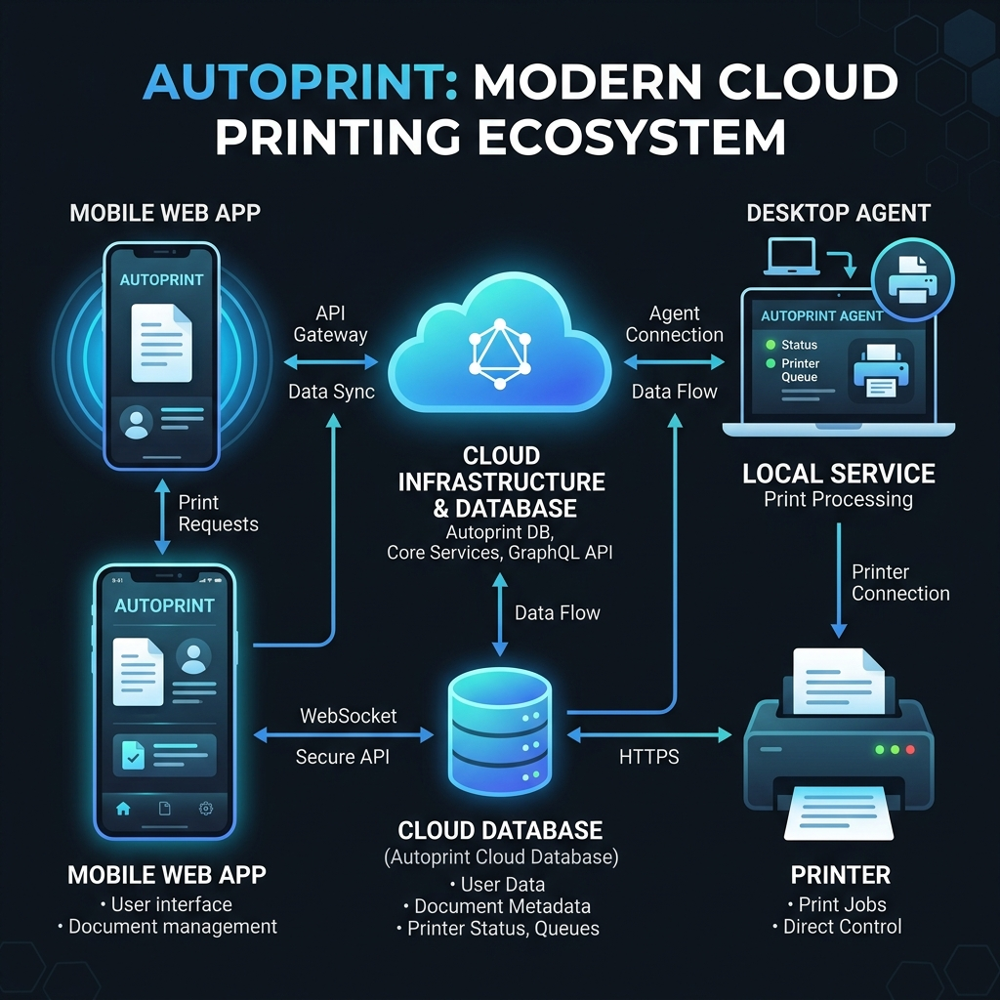
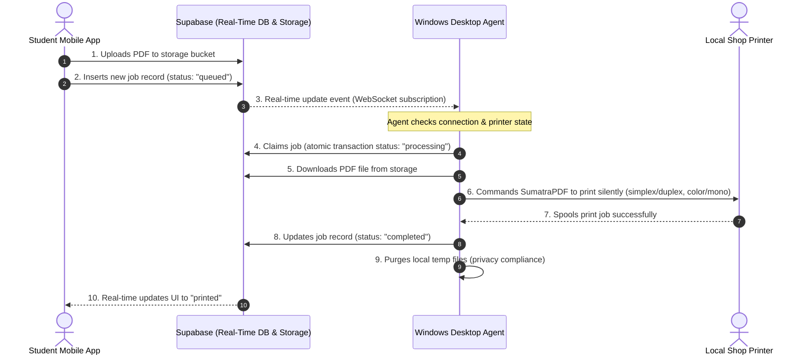
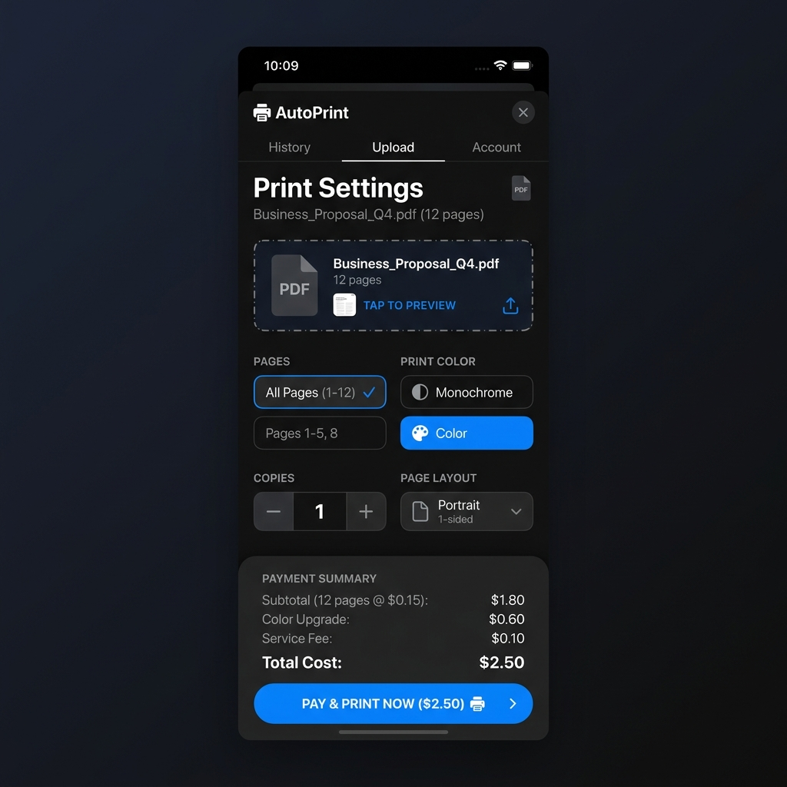
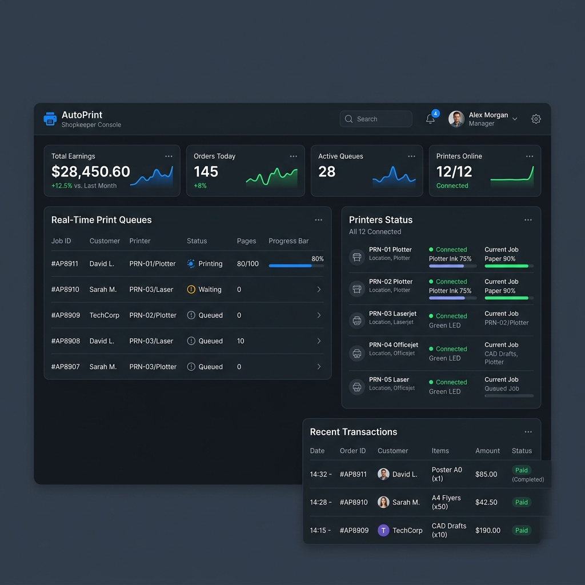

# 🖨️ AutoPrint — Automated University Printer Kiosk System

AutoPrint is an automated, hardware-integrated print-on-demand platform designed for university campuses and copy shops. It allows students to scan a QR code at a copy shop, upload PDF documents directly from their mobile browser, configure layout preferences (pages, copies, color vs B&W, simplex/duplex), pay via Razorpay/UPI, and have the documents print instantly and silently on the shop's physical printer. 

This repository contains the complete engineering portfolio for the product, including a mobile-first responsive web client, a Node.js API backend server, and a silent Windows desktop print agent daemon.

---

## 🏗️ Architecture & System Design

AutoPrint uses a hybrid cloud architecture to bridge client-side web requests with local on-premise hardware printers.

### Conceptual Workflow


### Real-Time Lifecycle Flow


---

## 📸 Screenshots

| Customer Mobile Checkout Screen | Shopkeeper Dashboard |
|:---:|:---:|
|  |  |

---

## 🛠️ Technology Stack

### Frontend Web App (Mobile-First)
- **Framework**: React 18 + Vite (SPA)
- **Styling**: Vanilla CSS (Tailored glassmorphism UI & custom dark mode palette)
- **State & Sync**: Supabase Realtime JS SDK (Real-time WebSocket subscriptions for status & ledger checks)
- **Asset Processing**: Client-side PDF page counter & pricing estimator

### Backend API Server
- **Runtime**: Node.js + Express
- **Real-time Engine**: Socket.io / Supabase Realtime
- **Payment Gateway**: Razorpay API Integration (UPI, cards, net banking)
- **Local Fallback DB**: Better-SQLite3 (For offline cache/hybrid operations)

### Windows Desktop Agent Client
- **Runtime**: Python 3.8+
- **Desktop Packaging**: PyInstaller + Inno Setup Compiler (compiles agent daemon to `AutoPrintSetup.exe` installer)
- **Native Interfaces**: `pywin32` (Windows Printer Spooler API hook)
- **PDF Engine**: SumatraPDF (silent background execution engine)

---

## 🚀 Key Features

* **Instant Real-Time Sync**: Utilizes Supabase PostgreSQL real-time listeners to trigger instant printing when a payment is processed.
* **Fail-Safe Crash Recovery**: If the print agent daemon crashes or the shop computer loses power mid-print, a recovery scan on startup automatically checks pending/interrupted jobs and reconciles database states.
* **Dynamic Pricing Engine**: Automated page-count calculation (excluding password-protected structures) with configured rates for B&W vs Color sheets and duplex layout discounts.
* **Security & Privacy Purge**: Strict customer privacy compliance; local PDFs are immediately shredded from agent temp directories upon successful spooling.
* **Multi-Shop Scaling**: Supports unique shop registry IDs, onboarding configuration guides, and independent shopkeeper dashboards to monitor ledger transactions and print queues.

---

## 📁 Repository Structure

```text
AutoPrint
├── README.md                      # Main portfolio documentation
├── architecture.png               # System architecture diagram
├── screenshots/                   # UI/UX screenshot mockups
├── frontend/                      # React/Vite client application
│   ├── src/                       # React pages & Supabase services
│   ├── .env.example               # Frontend environment template
│   └── package.json
├── backend/                       # Node.js API server
│   ├── src/                       # Express server, routes & database hooks
│   ├── migrations/                # Database schemas & SQL setup scripts
│   ├── .env.example               # Backend environment template
│   └── package.json
├── windows-agent/                 # Windows Desktop Python client
│   ├── agent.py                   # Main polling & connection daemon
│   ├── setup_wizard.py            # Tkinter configuration GUI
│   ├── config.py                  # Environment loader & default falls
│   ├── config.json.example        # Local agent config JSON schema
│   ├── sumatrapdf/                # SumatraPDF binary files
│   └── autoprint_setup.iss        # Inno Setup installation compiler
└── docs/                          # Guides, review logs, and runbooks
```

---

## ⚙️ Setup & Installation

Detailed step-by-step guides can be found inside the [docs/](docs/) folder:
- **Database & Server Setup**: [docs/deployment_guide.md](docs/deployment_guide.md)
- **Codebase & Architecture Walkthrough**: [docs/handover_documentation.md](docs/handover_documentation.md)

### 1. Database Setup
1. Create a project on [Supabase](https://supabase.com/).
2. Run SQL scripts inside `backend/migrations/` (specifically `supabase_schema.sql` and `migration_security.sql`) inside the Supabase SQL editor to bootstrap the tables and row-level security (RLS) policies.

### 2. Frontend Web App
```bash
cd frontend
cp .env.example .env
# Fill in your Supabase project credentials in .env
npm install
npm run dev
```

### 3. Backend API Server
```bash
cd backend
cp .env.example .env
# Set Razorpay API keys and database configuration
npm install
npm run dev
```

### 4. Windows Desktop Agent
```bash
cd windows-agent
# Create a virtual environment and install dependencies
python -m venv .venv
.venv\Scripts\activate
pip install -r requirements.txt
# Copy config template
cp config.json.example config.json
# Run agent in simulation mode:
python agent.py
```

---

## 🗺️ Future Roadmap

- [ ] **End-to-End Encryption**: Encrypt PDFs on client browsers using AES-256 before upload; decrypt them in memory directly in the Windows Agent.
- [ ] **Advanced Print Job Routing**: Automatic routing to multiple printers based on black-and-white vs color configurations.
- [ ] **Full Supabase Auth Integration**: Restrict shopkeeper dashboard access with proper JWT credentials and security assertions.
- [ ] **Auto-Update System**: Integrate automatic client binary updates via Github Releases.
