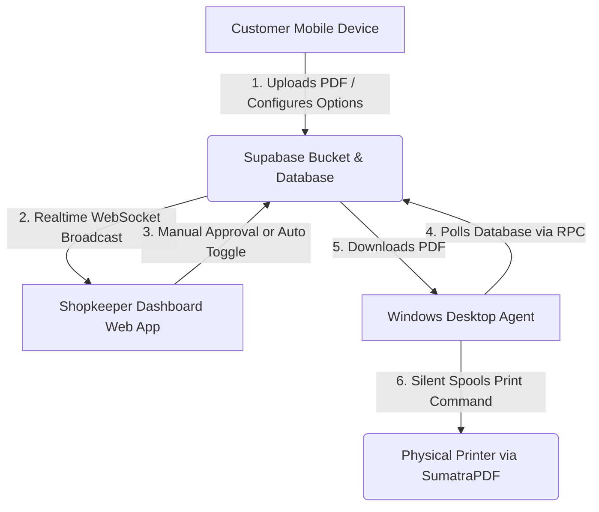

# AutoPrint - Comprehensive Project Handover & State Documentation

This document describes the complete architecture, database schema, frontend web application, python desktop agent, build system, and current development state of AutoPrint. It is designed to allow a new developer or an AI LLM to quickly understand the codebase and resume development smoothly.

---

## 1. System Architecture Overview

AutoPrint is an instant-printing kiosk system designed to let print shops receive and print documents from customers without manual file sharing (e.g. WhatsApp, emails). The system consists of three primary components:



1. **Customer Portal (React frontend):** Customers scan a QR code at the counter, which opens a webpage with the shop’s unique code (e.g. `?shop=KRL004`). They upload a PDF, select options (B&W/Color, single/double-sided, copies), and submit.
2. **Database & Storage (Supabase):** Manages shop registries, heartbeat checks, print job states, and stores PDF files in a storage bucket.
3. **Shopkeeper Dashboard & Console (React frontend):** A live web panel showing active queue stats, settings, a split-screen pending approval queue, and a scrollable recent print log with automatically calculated costs.
4. **Desktop Agent (Python/PyInstaller/Inno Setup):** A silent Windows background app running on the shopkeeper's PC. It updates the shop's online heartbeat, pulls approved print jobs via Postgres RPC, downloads PDFs from storage, and spools them to physical printers using SumatraPDF.

---

## 2. Database Schema & State (Supabase PostgreSQL)

The database schema is fully defined through 5 SQL migration files located in the root directory:
* [supabase_schema.sql](file:///f:/Projects/Printer%20automation/supabase_schema.sql)
* [migration_v2.sql](file:///f:/Projects/Printer%20automation/migration_v2.sql)
* [migration_v3.sql](file:///f:/Projects/Printer%20automation/migration_v3.sql)
* [migration_v4.sql](file:///f:/Projects/Printer%20automation/migration_v4.sql)
* [migration_v5.sql](file:///f:/Projects/Printer%20automation/migration_v5.sql)

### 2.1 Core Tables

#### `public.shops`
Stores shop registries, configurations, and online heartbeat status.
* `id` (UUID, Primary Key, Defaults to `gen_random_uuid()`)
* `name` (TEXT, Not Null)
* `is_active` (BOOLEAN, Default `true`)
* `created_at` (TIMESTAMP WITH TIME ZONE, Default `now()`)
* `last_seen_at` (TIMESTAMP WITH TIME ZONE, Nullable) - Updated by agent every 20 seconds.
* `shop_code` (TEXT, Unique) - Human-readable shop identifier matching pattern `^[A-Z]{3}\d{3}$` (e.g. `KRL004`).
* `print_mode` (TEXT, Default `'manual'`, Check constraint: `IN ('manual', 'auto')`).

#### `public.print_jobs`
Manages the lifecycle and printing details of each uploaded document.
* `id` (UUID, Primary Key, Defaults to `gen_random_uuid()`)
* `shop_id` (UUID, References `shops(id) ON DELETE CASCADE`)
* `file_path` (TEXT) - Direct reference to the PDF file path in the Supabase storage bucket.
* `file_name` (TEXT) - Original user-friendly name of the document (e.g., `resume.pdf`).
* `copies` (INTEGER, Default `1`, Check constraint: `>= 1`)
* `page_count` (INTEGER, Nullable, Check constraint: `IS NULL OR page_count >= 1`)
* `status` (TEXT, Default `'queued'`, Check constraint: `IN ('queued', 'approved', 'processing', 'printing', 'completed', 'failed', 'rejected')`)
* `color_mode` (TEXT, Default `'bw'`, Check constraint: `IN ('bw', 'color')`)
* `duplex` (BOOLEAN, Default `false`) - `true` means double-sided printing.
* `error` (TEXT, Nullable) - Holds error diagnostic messages in case of print failures.
* `created_at` (TIMESTAMP WITH TIME ZONE, Default `now()`)
* `updated_at` (TIMESTAMP WITH TIME ZONE, Default `now()`)

### 2.2 Security & Policies (Row Level Security)
Row Level Security is enabled on both tables to protect client and shop data while allowing anonymous web access:
* **Shops Select:** Publicly allowed for any active shop (`is_active = true`).
* **Print Jobs Select:** Publicly allowed for client-side status page tracking.
* **Print Jobs Insert:** Allowed if the job is inserted with initial status `'queued'` (manual approval) or `'approved'` (auto print mode).
* **Print Jobs Update:** Locked down strictly using a PostgreSQL trigger-like checker:
  * Updates are allowed only if the status transitions follow strict state-machine rules:
    $$\text{queued} \rightarrow \text{approved} \text{ or } \text{rejected}$$
    $$\text{approved} \rightarrow \text{processing}$$
    $$\text{processing} \rightarrow \text{completed} \text{ or } \text{failed}$$
    $$\text{failed} \rightarrow \text{approved} \text{ (on Retry trigger)}$$

### 2.3 PostgreSQL RPC Functions (Security Definer)
Bypasses basic RLS policies securely to perform complex operations:
* `claim_next_job(target_shop_id UUID)`: Used by the desktop agent to atomically select the next oldest `approved` print job for their shop, lock the row (`FOR UPDATE SKIP LOCKED`), and change its status to `processing`. Returns the row contents.
* `update_shop_print_mode(target_shop_id UUID, new_mode TEXT)`: Used by the dashboard to toggle the print mode settings between `'manual'` and `'auto'`.

### 2.4 Real-time Replication publication
Replication is active for PostgreSQL changes broadcasts:
* Enabled using: `ALTER PUBLICATION supabase_realtime ADD TABLE public.print_jobs;`

---

## 3. Frontend Web App (Vite React Client)

Located under `/frontend`. Built using Vite and React, styled with Vanilla CSS tokens defined in [index.css](file:///f:/Projects/Printer%20automation/frontend/src/index.css).

### 3.1 Routing Structure ([App.jsx](file:///f:/Projects/Printer%20automation/frontend/src/App.jsx))
* `/` ([Home.jsx](file:///f:/Projects/Printer%20automation/frontend/src/pages/Home.jsx)): Connect portal for customers. Supports URL queries (e.g. `/?shop=KRL004`) to validate and connect instantly.
* `/status/:jobId` ([Status.jsx](file:///f:/Projects/Printer%20automation/frontend/src/pages/Status.jsx)): Client-side status tracker showing the real-time processing timeline of their job.
* `/shop/:shopId` ([Shop.jsx](file:///f:/Projects/Printer%20automation/frontend/src/pages/Shop.jsx)): Main dashboard for the shop owner to download the installer, copy the shop code, download the kiosk QR code canvas, and monitor general queue stats.
* `/shop/:shopId/console` ([ShopConsole.jsx](file:///f:/Projects/Printer%20automation/frontend/src/pages/ShopConsole.jsx)): Fullscreen workspace with large click actions, a slide-up animation queue, and live price calculators.

### 3.2 Dynamic Pricing Engine
Cost calculations are computed in frontend views using the following standard shop rates (values in Paise: 100 paise = ₹1.00):
* **Base Black & White Page (PBW):** 200 paise (₹2.00)
* **Base Color Page (PCLR):** 500 paise (₹5.00)
* **Double-sided (Duplex) Discount:** 10% reduction off the subtotal.
* **Calculation Formula:**
  $$\text{Subtotal} = (\text{Page Count} \times \text{Copies}) \times \text{Price Per Page}$$
  $$\text{Discount} = \text{Duplex} ? \text{Math.floor}(\text{Subtotal} \times 0.10) : 0$$
  $$\text{Total Price} = (\text{Subtotal} - \text{Discount}) / 100$$

### 3.3 Real-time Data Syncing
Real-time dashboard refreshes are handled by subscribing to Supabase WebSocket channel channels on component mount:
```javascript
const channel = supabase
  .channel(`print_jobs_console_${shopId}`)
  .on(
    'postgres_changes',
    { event: '*', schema: 'public', table: 'print_jobs', filter: `shop_id=eq.${shopId}` },
    (payload) => { fetchJobs(); }
  )
  .subscribe();
```

---

## 4. Desktop Agent Client (Windows Python App)

Located under `/windows-agent`. Runs in python 3.x virtual environment.

### 4.1 Modular Structure
* [launcher.py](file:///f:/Projects/Printer%20automation/windows-agent/launcher.py): The entry point executable. Acquires `Global\AutoPrintLauncherMutex` to prevent multiple launch instances. Checks if first-run configuration is completed. If not, runs `setup_wizard.py` synchronously. If configuration exists, spawns `agent.py` as a independent, detached background process (`subprocess.DETACHED_PROCESS` in Windows) and exits.
* [setup_wizard.py](file:///f:/Projects/Printer%20automation/windows-agent/setup_wizard.py): A Tkinter-based configuration GUI. Handles shop verification, fetches active Windows printer queues, prints a test page, and saves settings to `%LocalAppData%\AutoPrint\config.json`.
* [agent.py](file:///f:/Projects/Printer%20automation/windows-agent/agent.py): The background daemon that polling Supabase.
  - Updates `shops.last_seen_at` heartbeat every 20 seconds.
  - Checks printer spooler queues every 30 seconds to update its tray icon status (`🟢 Green` for online, `🔴 Red` for print errors, `🔵 Blue` for printing).
  - Triggers a **Crash Recovery** scan on startup: scans database for print jobs stuck in `'processing'` or `'printing'` state. If found in the local Windows print queue, changes DB status to `'completed'`; otherwise, changes it to `'failed'` with recovery logs so users can retry.
  - Polls `claim_next_job` RPC. Downloads PDFs to isolated temp storage, forwards duplex/color settings, and deletes files post-print.
* [print_executor.py](file:///f:/Projects/Printer%20automation/windows-agent/print_executor.py): Spools PDF prints to Windows via SumatraPDF. Command parameters:
  - B&W Duplex: `SumatraPDF.exe -print-to <printer_name> -print-settings "monochrome,duplex" <file_path>`
  - Color Single-sided: `SumatraPDF.exe -print-to <printer_name> -print-settings "color,simplex" <file_path>`

---

## 5. Build, Compile & Deploy Runbooks

### 5.1 Web Deployment (Vercel)
The project is built on Vercel using Vite:
* Root folder: `/frontend`
* Local `.env` config:
  ```env
  VITE_SUPABASE_URL=https://your-project.supabase.co
  VITE_SUPABASE_ANON_KEY=your-supabase-anon-key
  VITE_AGENT_DOWNLOAD_URL=/AutoPrintSetup.exe
  ```
* Command: `vercel --prod` to deploy updates.

### 5.2 Desktop Binary Packaging (PyInstaller)
Compiled targets are managed in [autoprint.spec](file:///f:/Projects/Printer%20automation/windows-agent/autoprint.spec).
1. Open terminal in `windows-agent/` directory.
2. Compile executables:
   ```powershell
   .\.venv\Scripts\pyinstaller.exe --noconfirm autoprint.spec
   ```
3. Compiled files will output under `windows-agent/dist/AutoPrint`.

### 5.3 Installer Compilation (Inno Setup)
Converts compiled binaries into a single executable `AutoPrintSetup.exe` using [autoprint_setup.iss](file:///f:/Projects/Printer%20automation/windows-agent/autoprint_setup.iss).
1. Run compilation command:
   ```powershell
   & "C:\Program Files (x86)\Inno Setup 6\ISCC.exe" autoprint_setup.iss
   ```
2. Output path: [windows-agent/dist/AutoPrintSetup.exe](file:///f:/Projects/Printer%20automation/windows-agent/dist/AutoPrintSetup.exe) (Size: ~51.1 MB).
3. Post-build task: Copy the compiled `AutoPrintSetup.exe` into `/frontend/public/` so that it is self-hosted on the website domain.

---

## 6. Open Items & Future Roadmap

* **Auth Integration:** Currently, database lookup/writes rely on public anonymous permissions with state-machine policies. For commercial scale, add shopkeeper authentication (Supabase Auth JWT) to restrict dashboard RPC update execution.
* **Pricing Engine Integration:** Connect Razorpay/UPI webhook APIs to support payments in manual/auto print cycles.
* **Multi-Printer Setup:** Implement scheduling queues to split jobs among color vs B&W physical units.
